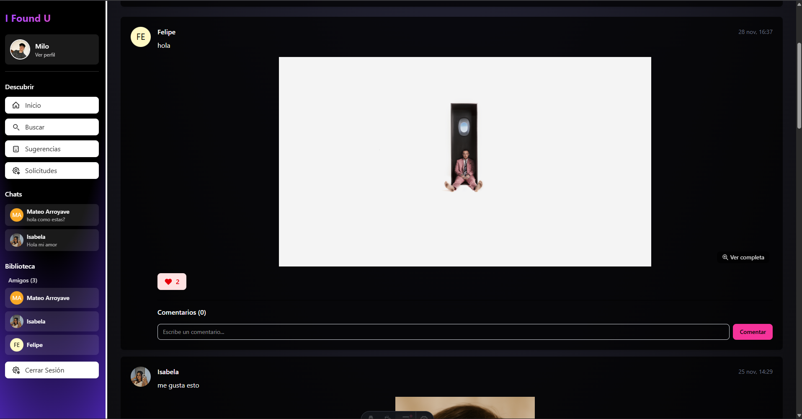
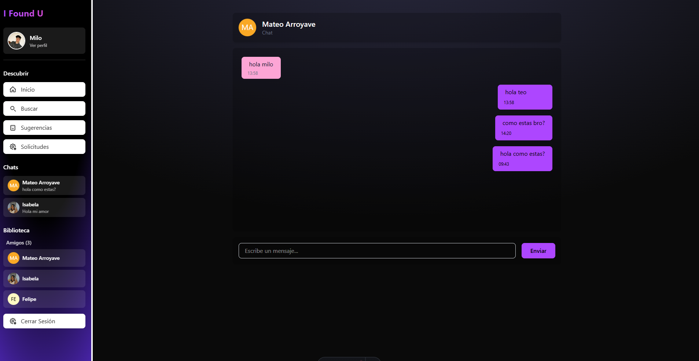

# Te-encontre
Proyecto final para la asignatura de bases de datos1

## Descripción
Proyecto basado en la creacion de una red social donde permita a los usuarios crear perfiles, enviar mensajes, buscar a otros usuarios, crear publicaciones y ver las publicaciones de los demás usuarios.

# Lenguajes utilizados
- HTML
- CSS
- JavaScript
- typescript

# Frameworks y librerías
- Astro
- TailwindCSS
- Node.js

# Base de datos
- MYSQL

## Login

## Registro

## Contenido principal

## Chat
