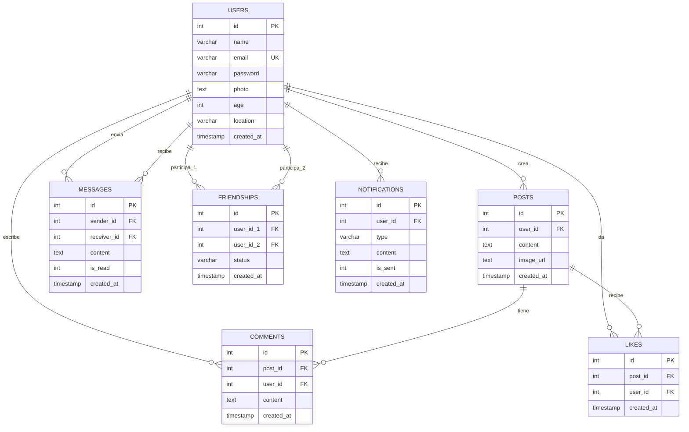

# Diagrama de Base de Datos - Te-Encontré

## 📊 Modelo Entidad-Relación Visual



---

## 🔗 Tipos de Relaciones

### 1:N (Uno a Muchos)
- **Usuario → Publicaciones**: Un usuario puede crear muchas publicaciones
- **Usuario → Comentarios**: Un usuario puede escribir muchos comentarios
- **Usuario → Likes**: Un usuario puede dar muchos likes
- **Usuario → Mensajes (enviados)**: Un usuario puede enviar muchos mensajes
- **Usuario → Mensajes (recibidos)**: Un usuario puede recibir muchos mensajes
- **Usuario → Notificaciones**: Un usuario puede recibir muchas notificaciones
- **Publicación → Comentarios**: Una publicación puede tener muchos comentarios
- **Publicación → Likes**: Una publicación puede recibir muchos likes

### N:M (Muchos a Muchos)
- **Usuario ↔ Usuario (Amistades)**: Implementada mediante tabla `friendships`
  - Un usuario puede tener muchos amigos
  - Tabla intermedia: `friendships` con `user_id_1` y `user_id_2`

---

## 📋 Resumen de Tablas

| Tabla | Propósito | Registros Típicos |
|-------|-----------|-------------------|
| **users** | Información de usuarios | Perfiles de usuarios |
| **friendships** | Relaciones de amistad | Solicitudes y amistades |
| **posts** | Publicaciones | Contenido compartido |
| **likes** | Me gusta | Interacciones positivas |
| **comments** | Comentarios | Conversaciones |
| **messages** | Mensajes privados | Chats entre usuarios |
| **notifications** | Notificaciones | Alertas del sistema |

---

## 🔍 Índices Implementados

### Índices Únicos
- `users.email` → Garantiza unicidad de emails

### Índices de Búsqueda
- `users.name` → Búsqueda de usuarios
- `users.location` → Filtrado por ubicación

### Índices de Relaciones
- `friendships.user_id_1` → Amistades por usuario
- `friendships.user_id_2` → Amistades por usuario
- `posts.user_id` → Publicaciones por autor
- `likes.post_id` → Likes por publicación
- `likes.user_id` → Likes por usuario
- `comments.post_id` → Comentarios por publicación
- `comments.user_id` → Comentarios por usuario
- `messages.sender_id` → Mensajes enviados
- `messages.receiver_id` → Mensajes recibidos
- `notifications.user_id` → Notificaciones por usuario

---

## 🎯 Vistas Principales

### 1. user_profile_summary
**Propósito:** Resumen de perfil con estadísticas
- Información del usuario
- Contador de publicaciones
- Contador de amigos

### 2. user_news_feed
**Propósito:** Feed personalizado de noticias
- Publicaciones de amigos
- Información del autor
- Contadores de likes y comentarios

### 3. network_stats
**Propósito:** Estadísticas globales
- Total de usuarios
- Total de publicaciones
- Total de comentarios
- Total de likes

### 4. post_details_view
**Propósito:** Detalles completos de publicaciones
- Contenido de la publicación
- Información del autor
- Estadísticas de interacción

---

## ⚙️ Procedimientos Almacenados

### 1. sp_insert_user
**Función:** Insertar nuevo usuario
**Parámetros:** name, email, password, photo, age, location

### 2. sp_delete_post
**Función:** Eliminar publicación y dependencias
**Acción:** Elimina likes, comentarios y la publicación

### 3. sp_notify_friends
**Función:** Notificar a todos los amigos
**Acción:** Crea notificaciones para amigos aceptados

---

## 🔐 Seguridad

### Contraseñas
- **Algoritmo:** bcrypt
- **Salt Rounds:** 10
- **Almacenamiento:** Hash irreversible

### Validaciones
- Email único (índice único)
- Validación de datos en API
- Prevención de SQL injection (ORM)

---

## 📈 Flujo de Datos Típico

### Crear Publicación
```
Usuario → Frontend → API (/api/posts/create) 
→ Validación → INSERT posts 
→ sp_notify_friends → INSERT notifications 
→ Respuesta → Actualización UI
```

### Ver Feed
```
Usuario → Frontend → API (/api/posts/get) 
→ Query getRecentPosts → JOIN users 
→ Respuesta con datos → Renderizado
```

### Enviar Solicitud de Amistad
```
Usuario → Frontend → API (/api/friends/request) 
→ INSERT friendships (status='pending') 
→ INSERT notification → Respuesta
```

---

## 💡 Conceptos de BD Aplicados

✅ **Normalización** - 3FN en todas las tablas  
✅ **Integridad Referencial** - Claves foráneas  
✅ **Índices** - Optimización de consultas  
✅ **Vistas** - Simplificación de consultas complejas  
✅ **Procedimientos** - Lógica de negocio encapsulada  
✅ **Transacciones** - Operaciones atómicas  
✅ **Seguridad** - Hashing de contraseñas  

---

## 🎓 Puntos Clave para Sustentación

1. **7 Tablas** relacionadas correctamente
2. **4 Vistas** para consultas complejas
3. **3 Procedimientos** almacenados
4. **11 Funciones** de consulta en queries.ts
5. **Drizzle ORM** para type-safety
6. **Índices estratégicos** para rendimiento
7. **Seguridad** con bcrypt
8. **Arquitectura moderna** con Astro + MySQL
